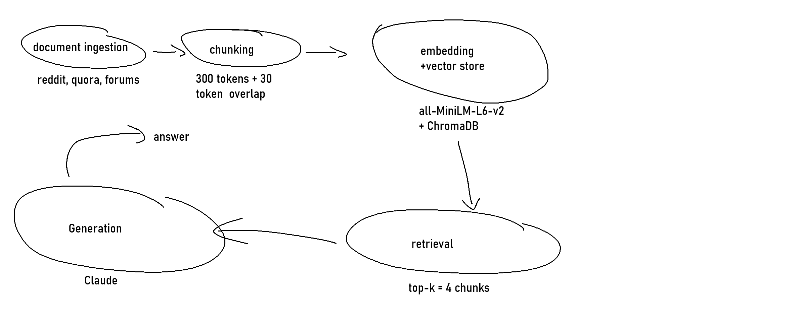

# Project 1 Planning: The Unofficial Guide

> Write this document before you write any pipeline code.
> Your spec and architecture diagram are what you'll use to direct AI tools (Claude, Copilot, etc.) to generate your implementation — the more specific they are, the more useful the generated code will be.
> Update the Retrieval Approach and Chunking Strategy sections if you change your approach during implementation.
> Update this file before starting any stretch features.

---

## Domain

<!-- What domain did you choose? Why is this knowledge valuable and hard to find through official channels? -->

The domain that I chose is "reviews of CS department at Rice University". This knowledge is valuable for those applying to Rice University's CS department and what to know what they are getting themselves into.

## Documents

<!-- List your specific sources: URLs, subreddit names, forum threads, or file descriptions.
     Aim for at least 10 sources that together cover different subtopics or perspectives within your domain. -->

| # | Source | Description | URL or location |
|---|--------|-------------|-----------------|
| 1 |Rate My Professors |indivdual reviews of professors from students |https://www.ratemyprofessors.com/search/professors/799?q=*&did=11 |
| 2 |Reddit |experience of CS from current and previous students |https://www.reddit.com/r/riceuniversity/comments/ttd93h/how_is_overall_computer_science_experience_at_rice/ |
| 3 |Academic Jobs |more information on the CS department |https://www.academicjobs.com/rate-my-professor/rice-university/5067 |
| 4 |Quora |potential professor reccomendations for first  year |https://www.quora.com/Which-professors-would-you-recommend-people-take-classes-from-at-Rice-University |
| 5 |Rice Edu |Rice University's own information on the CS department |https://ga.rice.edu/programs-study/departments-programs/engineering/computer-science/ |
| 6 |Facebook |Rice's Facebook page where they post events |https://www.facebook.com/RiceCS/ |
| 7 |Quora |describing what jobs look like after attending Rice from previous students |https://www.quora.com/Is-it-worth-it-to-go-to-Rice-for-computer-science-grad-school-What-are-the-job-prospects-after-attending-Rice-as-well-as-the-return-on-investment |
| 8 |Reddit |life after attending Rice |https://www.reddit.com/r/riceuniversity/comments/j1pbre/postgraduation_destinations/ |
| 9 |GradCafe |students considering Rice's PhD program after they complete their bachelors |https://forum.thegradcafe.com/topic/16994-has-anybody-heard-from-rice-univ-cs-phd-program/ |
| 10 |Linkedin |information on other people who've attended Rice and what offers they have |https://www.linkedin.com/company/ricecs/ |

---

## Chunking Strategy

<!-- How will you split documents into chunks?
     State your chunk size (in tokens or characters), overlap size, and explain why those
     numbers fit the structure of your documents.
     A review-heavy corpus warrants different chunking than a long FAQ. -->

**Chunk size:**
300 Tokens
**Overlap:**
30 Tokens
**Reasoning:**
Just learned that around 200-300 tokens is suffcient enough for quick paragraphs. So, I settled on 300 tokens as majority of my resources are responses from people that are around 1-3 paragraphs. A small overlap is there to ensure no context is lost for those responses that drag on for longer than they should.
---

## Retrieval Approach

<!-- Which embedding model are you using (e.g., all-MiniLM-L6-v2 via sentence-transformers)?
     How many chunks will you retrieve per query (top-k)?
     If you were deploying this for real users and cost wasn't a constraint, what tradeoffs
     would you weigh in choosing a different embedding model — context length, multilingual
     support, accuracy on domain-specific text, latency? -->

**Embedding model:**
all-MiniLM-L6-v2 via sentence-transformers
**Top-k:**
3
**Production tradeoff reflection:**
Not even sure what possible other embedding models there are or what they even are. But, if the embedding model I've already chosen does the bare minimum then more is not needed. Mainly because the information isn't much to decipher to begin with. Multilingual support is not needed as most of the posts are from English websites. 
---

## Evaluation Plan

<!-- List your 5 test questions with their expected correct answers.
     Questions should be specific enough that you can judge whether the system's response
     is right or wrong. "What are good dining halls?" is too vague.
     "What do students say about wait times at [dining hall name] during lunch?" is testable. -->

| # | Question | Expected answer |
|---|----------|-----------------|
| 1 |Is Devika Subramanian a decent professor for my first semester? |She is a solid professor as majority of students rated her at least a 3. |
| 2 |Is there grade inflation  within Rice at all, or is it extremely difficult?  |Not really, but with collaboration of you and other students you can get by. |
| 3 |Who is the department chair of the CS department and their contact information? |The department chair is Christopher M. Jermaine and their method of contact is through email: christopher.m.jermaine@rice.edu. |
| 4 |What's the most recent workshop they've held for students? |Rice University is hosting the Crossroads of AI & Society Workshop at the Rice Global Paris Center, July 15-16, 2026 in Paris, France. |
| 5 |Is Rice University's CS department worth it for grad school in terms of job prospects? |Students and alumni reflect positively on job prospects, noting strong research opportunities. |

---

## Anticipated Challenges

<!-- What could go wrong? Name at least two specific risks with reasoning.
     Consider: noisy or inconsistent documents, missing source attribution, off-topic
     retrieval, chunks that split key information across boundaries. -->

1.
There are many pop-ups that may appear from some of these sites which may result in issues with proper retrieval.
2.
The information might not  be what they were looking for exactly which may lead to responses being off.
---

## Architecture

<!-- Draw a diagram of your pipeline showing the five stages:
     Document Ingestion → Chunking → Embedding + Vector Store → Retrieval → Generation
     Label each stage with the tool or library you're using.
     You can use ASCII art, a Mermaid diagram, or embed a sketch as an image.
     You'll use this diagram as context when prompting AI tools to implement each stage. -->

## AI Tool Plan

<!-- For each part of the pipeline below, describe:
     - Which AI tool you plan to use (Claude, Copilot, ChatGPT, etc.)
     - What you'll give it as input (which sections of this planning.md, which requirements)
     - What you expect it to produce
     - How you'll verify the output matches your spec

     "I'll use AI to help me code" is not a plan.
     "I'll give Claude my Chunking Strategy section and ask it to implement chunk_text()
     with my specified chunk size and overlap" is a plan. -->

**Milestone 3 — Ingestion and chunking:**
Plan to use Claude. Hope to give texts from the short paragraphs from the URLs. The chunking plan was to use 300 token chunks with a 30 token overlap to achieve within boundary answers. 
**Milestone 4 — Embedding and retrieval:**
Use all-MiniLM-L6-v2 via sentence-transformers and store vectors in ChromaDB. This will be done through Claude. The answered will be verified through the 5 questions I already thought of prior.
**Milestone 5 — Generation and interface:**
Give the test questions and compare afterwards through the usage chunks gathered by Claude.